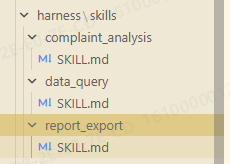

---
id: report_export
name: 报告导出
description: 将分析结果和图表组装为报告，支持 HTML 和 Excel 格式导出
category: export
input_schema:
  format: html|excel
  title: string
  sections: list
  charts: list
output_schema:
  format: string
  file_path: string
  content_length: number
  download_url: string
supported_tools:
  - complaint_query
  - chart_render
  - report_export
routing_keywords:
  - 导出
  - 报告
  - 生成报告
  - 下载
  - HTML
  - Excel
  - 报表
enabled: true
priority: 3
---

# 报告导出 Skill

## 功能
将多轮分析结果、图表和数据汇总组装为结构化报告，支持导出为 HTML 或 Excel 格式。

## 支持的导出格式
| 格式 | 说明 | 特点 |
|------|------|------|
| HTML | 交互式网页报告 | 内嵌 ECharts 图表，支持筛选交互 |
| Excel | 电子表格报告 | 多工作表（摘要、明细、图表数据） |

## 报告章节结构
1. **摘要概览**: KPI 指标、投诉趋势、关键发现
2. **产品线分析**: 各产品线投诉量、原因分布、TOP 不良类型
3. **原因分析**: 制造/研发/客户/仓储原因细分
4. **大客户分析**: 投诉量 TOP 客户明细
5. **洞察建议**: 数据驱动改进建议

## 使用流程
1. 通过 `complaint_query` 获取分析数据
2. 通过 `chart_render` 生成 ECharts 图表
3. 通过 `report_export` 组装并导出报告文件
4. 返回文件路径和下载链接
